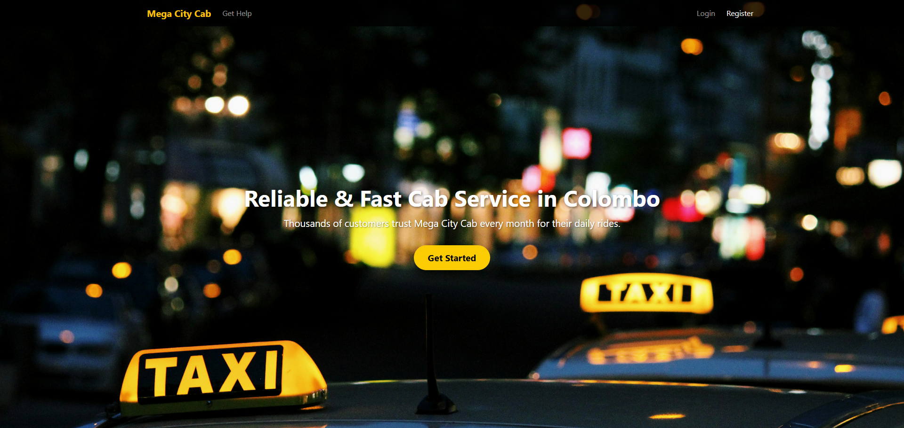
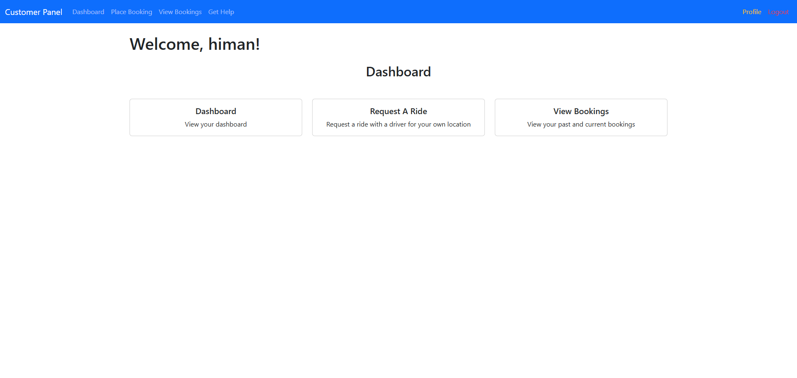
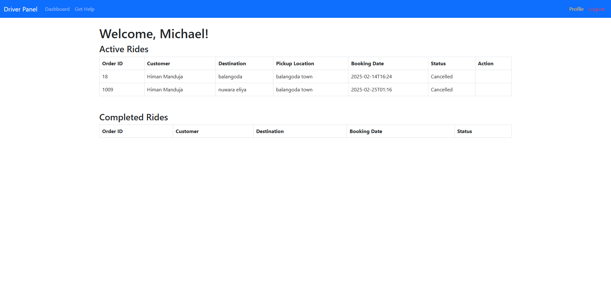

# 🚖 Mega City Cab Service

## 📌 Overview
Mega City Cab Service is a **local ride-hailing system** designed for seamless **ride booking, driver management, and admin control**. It operates entirely on a **local Apache Tomcat server** within **IntelliJ IDEA**, using **Java (Spring Boot) and MySQL** for backend functionality.

---

## 📷 Screenshots
### 📍 Home Page



### 📍 Passenger Dashboard



### 📍 Driver Dashboard



### 📍 Admin Panel


---

## 🚀 Features

✅ **Passenger Features:**
- User **registration & login**
- Ride **booking & cancellation**
- View **ride history**
- **Ratings & feedback** for drivers

✅ **Driver Features:**
- Accept & complete ride requests
- View assigned trips & earnings
- Manage **availability status**

✅ **Admin Features:**
- **User & ride management**
- Dispute handling
- **System monitoring & analytics**

✅ **System Features:**
- **MySQL database integration**
- **Secure authentication (hashed passwords)**
- **Role-based access control**

---

## 💻 Local Deployment

### 📦 Prerequisites
- **JDK 11+**
- **Apache Tomcat (configured in IntelliJ IDEA)**
- **MySQL Server**

### 🔧 Setup Steps

#### 1️⃣ Clone the Repository
```bash
git clone https://github.com/HimanM/megacitycab.git
cd mega-city-cab-service
```
#### 2️⃣ Set Up MySQL Database
**Open MySQL and create a database:**

```sql
CREATE DATABASE mega_city_cab;
Import the provided database.sql file.
```

#### 3️⃣ Configure IntelliJ IDEA
- **Open IntelliJ IDEA and load the project.**
- **Set up Tomcat Server under Run Configurations.**
- **Verify MySQL connection in application.properties.**

#### 4️⃣ Run the Application
- **Start MySQL Server.**
- **Click Run in IntelliJ IDEA to start the Tomcat Server.**
- **Open a browser and visit:**
```http://localhost:8080/megacitycab_war_exploded/```

### 📁 Project Structure

```
📂 MegaCityCabService
┣ 📂 src
┃ ┣ 📂 main
┃ ┃ ┣ 📂 java/com/megacitycab
┃ ┃ ┃ ┣ 📂 controllers   # Handles requests & responses
┃ ┃ ┃ ┣ 📂 models        # Database entity models
┃ ┃ ┃ ┣ 📂 repositories  # Database queries
┃ ┃ ┃ ┣ 📂 services      # Business logic layer
┃ ┃ ┣ 📂 resources
┃ ┃ ┣ 📂 webapp          # Web resources
┃ ┃ ┃ ┣ 📜 application.properties  # Database & app settings
┃ ┃ ┣ 📂 test            # Unit tests          
┣ 📂 database
┃ ┣ 📜 database.sql      # Initial database script
┣ 📂 images              # Screenshots for README
┣ 📜 pom.xml             # Project dependencies (Maven)
┣ 📜 README.md           # Documentation
```

### 🛠️ Technologies Used

- **Backend: Java (Spring Boot)**
- **Database: MySQL**
- **Server: Apache Tomcat (Locally Hosted)**
- **Frontend: HTML, CSS, JavaScript**
- **Authentication: Hashed Passwords**

### 📌 Contributors
👤 Your Name - Himan Manduja (https://github.com/HimanM)